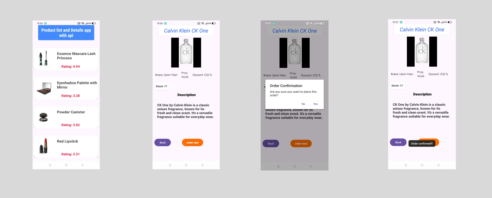

# DemoProduct: A Showcase of Product Browsing and Details

## Overview

DemoProduct is an Android application that demonstrates a modern product browsing experience. Users can explore a curated list of products, view detailed information about each item, and potentially proceed with anorder. Built with Kotlin and leveraging popular libraries like Retrofit, Picasso, and RecyclerView, this app showcases efficient data handling and UI rendering.

## Features

*  Product Browsing:  Explore a diverse range of products presented with captivating images, titles, and brief descriptions within a smooth-scrolling RecyclerView.
*  Product Details:  Dive deeper into a selected product by accessing a dedicated description activity. View comprehensive information, including high-resolution images, product name, stock availability, price, brand, discount percentage, and a detailed description.
*  Efficient Data Handling:  Retrofit seamlessly fetches product data from an external API, while JSON parsing ensures data integrity and efficient handling.
*  Image Display:  Picasso effortlessly loads and displays high-quality product images, enhancing the visual appeal of the app.
*  User-Friendly Interface:  The app features a clean and intuitive design, crafted using XML layouts, for easy navigation and a pleasant user experience.
*  Order Confirmation:  An order button triggers an alert dialog box, providing a clear confirmation step before proceeding with an order.

## Technologies Used

*  Kotlin:  The primary programming language for the app's logic and UI interactions.
*  Retrofit:  A powerful HTTP client for seamless communication with the product API.
*  JSON:  The data format used for efficient data exchange between the app and the API.
*  Picasso:  A popular image loading library for displaying high-quality product images.
*  XML:  Used for designing the app's layouts and defining the user interface elements.
*  RecyclerView:  A flexible and efficient view for displaying lists of products.

## Pictures

## Getting Started

1.  Clone the repository:  `git clone [repository URL]`
2.  Open in Android Studio:  Import the project into Android Studio.
3.  Build and Run:  Build the project and run it on an emulator or physical device.

## Potential Enhancements

*  Order Functionality:  Implement a complete order placement flow, including user authentication, payment integration, and order confirmation.
*  Search and Filtering:  Add features to search for products and filter them by category, price, or other criteria.
*  User Reviews and Ratings:  Integrate user reviews and ratings to enhance the product browsing experience.
*  Shopping Cart:  Implement a shopping cart to allow users to add multiple items before placing an order.

## Contributing

Contributions are welcome! Please feel free to submit pull requests or open issues for bug reports and feature suggestions.

## Contact

Emdad Hossain - devemdadhossain@gmail.com
